# 项目开发记录

## 项目说明

本项目采用python3.7，框架使用Django2.2，使用mysql数据库。（本来想使用django框架自带的sqlite数据库，但是想到可能后期数据很多，这个本来也是一个数据统计的平台，所以对数据库要求比较高，mysql的效率应该会比sqlite好一点，虽然sqlite方便一点）

IDE：

使用Pycharm 2018，电脑环境为MacOs Catalina 10.15

项目全程使用终端和Pycharm编译器进行处理

项目开发模式：

采用MVT模式，即model+view+template

第一次接触类似于mvc模式的项目开发模式，模型操作数据，视图操作具体用户前端的请求，模版为html前端渲染。

## 项目前五天完成的东西

登陆界面

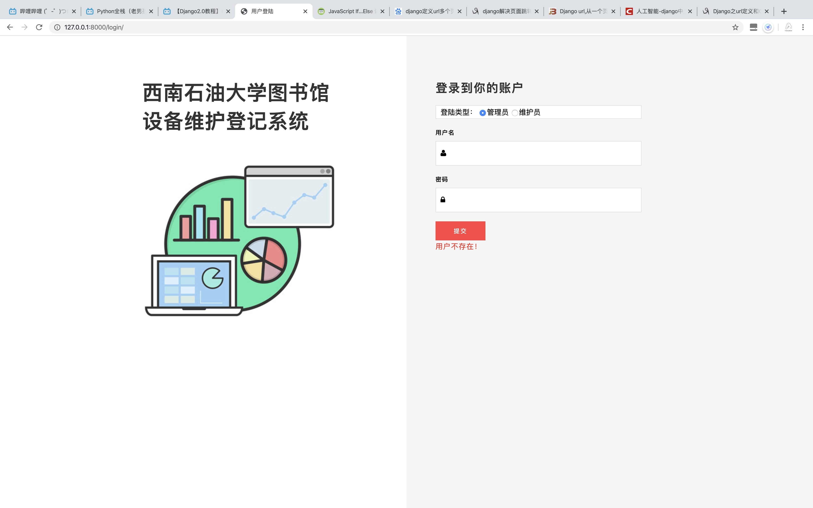

管理员首页

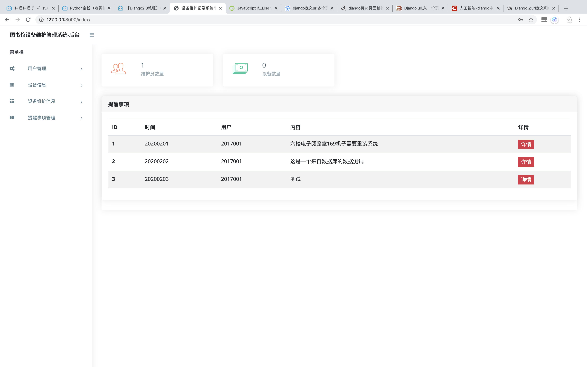

数据库表（左边的是django原来的表，右边的是暂时设计的几张表）

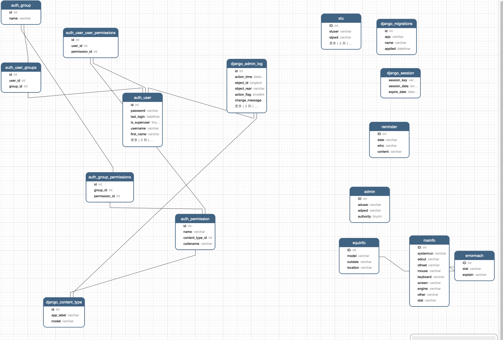

## 前五天遇到的困难

### ajax提交困难

在前端提交表单的时候，目前的方法是<form>标签提交表单，每次自己定义提交类型，POST或者是GET，但是这样的话每次都会刷新一下页面，重新来一次http请求，有时候我们不需要页面刷新，所以自己在使用ajax提交的时候一直提交不上，只是在登陆界面提交用户信息到后台时遇到这些问题，以前没有用过ajax，后期再练习。

### MVC模式不熟悉

刚开始是自己写sql语句进行数据库操作，采用pymysql进行处理，后面使用了model来进行数据库操作，但是刚开始没有使用异常处理导致出错，后面慢慢熟悉了一下model的objects的一些方法。

### 前端布局，以及js的交互操作

以前只是使用网上的一些前端模版自己修改然后为我所用，里面定义了大量的js，这次使用的模版也是使用了大量的js，实现了很多很好看的动态，但是并不能为我所用，能进行一些简单的样式修改，但时常改崩。

### cookie以及session的使用

目前还没有使用cookie以及session，导致没法判断用户的登录状态，所以后续会加入操作进行判断，不然直接输网址就进入了后台界面不行的。

## 下面需要进行的工作

1. 完成用户管理的子页面
2. 关于url进行动态分配，继续学习关于路由分配的操作
3. 关于前端模版进行复用操作，定义base.html使用django的一些block，extends等的使用
4. 后续的数据库操作全部使用model，不自己写sql语句，提升开发效率
5. 边开发边修改数据库的设计，目前的设计感觉迟早出错，但是这也不是一个很复杂的系统

## 第二阶段完成的东西

1. 修改了数据库的外键关系，新增字段，但是后面多半还有改
2. url进行管理，不让所有url都在总路由里面
3. 模版复用完全解决，提升了开发效率
4. 关于模型的使用更加顺手
5. 解决模态框问题，实现点击按钮弹出对应内容，后期实现弹框进行修改
6. 新加入了分页器，更加灵活
7. 新使用session记录用户登陆状态，虽然没有使用cookie进行对比，但是已经可以实现验证用户是否登陆从而使得页面访问具有权限问题，并且加入了用户登出操作

目前完成的东西都能得到体现，右上角用户登陆状态已经登出，分页器

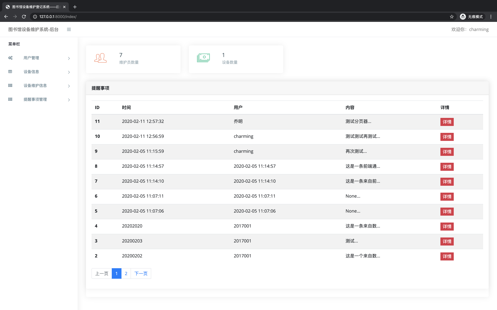

模态框操作

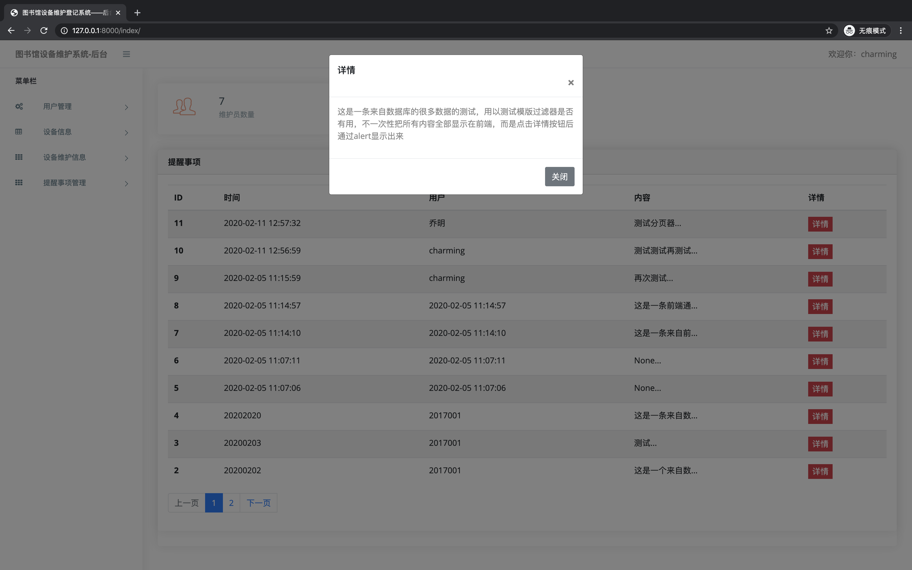

## 下一阶段准备完成的东西

1. 完成所有页面的数据库数据展示
2. 新增修改与删除功能
3. 通过page进行机器维护信息的详细展示，使用primary key进行页面绑定

## 这一阶段完成了项目demo，项目总耗时大概不到20天

#### 阶段大概总结

项目情况：大概15/6个前端界面，但是界面通过模版扩展很多高度重用，所以前端看起来差不多

后端用到django框架，一些render，redirect等类，django分页器等，还有一些异常处理等操作，实现了基本的增删改查以及一些高级的多表链接的搜索，查看等功能，还有网页之间的数据传输等操作。

这一个demo版本用到的技术并不是很多，因为python有点基础并且python语言的便捷，并且并没有实现一些算法类的东西，并没有遇到很大的困难，最困难的可能是刚开始不知道django框架的使用方法，前后端如何交互等，但是网上一些教程看了之后就基本上简单的前后端交互都能做了，从刚开始定义的数据库表当然在后期也是修改了很多次，也添加了一些表。

#### 阶段经历（几个新的接触的东西）

刚开始不知道还不清楚django的mvt模式，没有用到django的模型操作，就自己写了使用pymysql操作数据库的方法进行简单数据库操作，如下图：

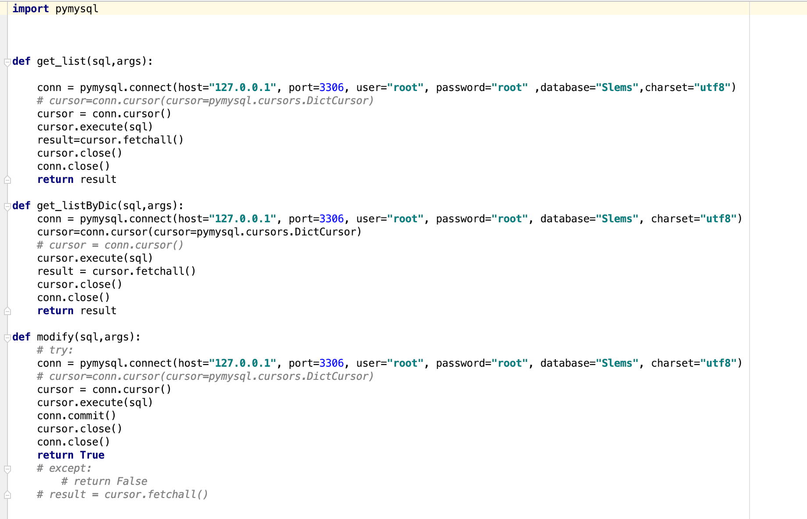

每次自己写sql语句调用方法进行操作，就连这三个方法也没有再次优化封装，但是后面了解到了django的模型后，采用了MVC的开发模式，生成了一个app，在app里面定义数据模型，直接调用模型的方法从而实现数据操作，非常方便

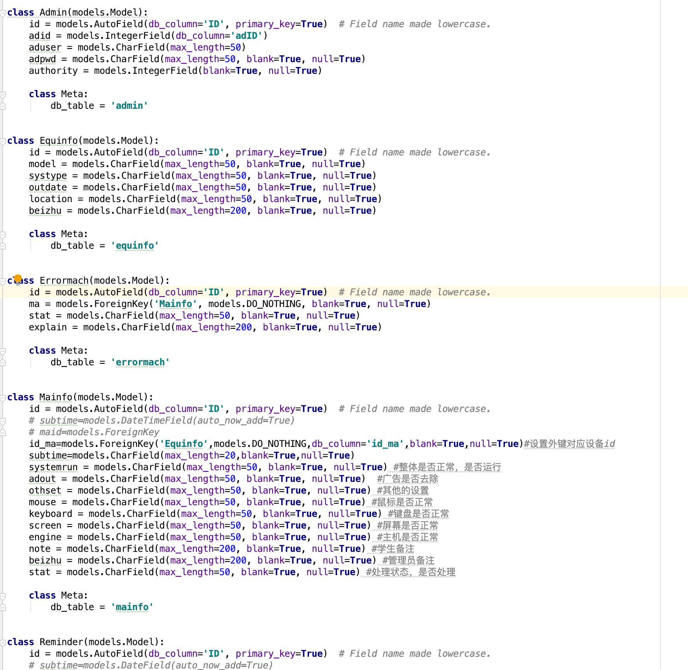

而且修改模型后直接makemigrations，然后migrate就行了，当然中间也遇到了一些问题，然后也解决了

然后就是数据交互，前台数据发到后台。刚开始全部使用的是form标签里面使用post方法，后台进行request.POST.get()取到值，这样的话每次一提交就会获取一次http请求，刷新一次页面，有时候不是我需要的刷新页面，所以使用了ajax进行数据发送，并且有些时候验证数据就放在js里面了，数据没通过就不发到后台。

再者就是前端框架，bootstrap很方便，一些button的类直接就可以看到效果，网上也有很多说明文档可以参考。

项目中大量使用了bootstrap的模态框，无论是数据的详情展示还是直接通过模态框修改数据都使用很多。

### 下一阶段的完成计划

1. 目前的代码很冗杂，但是是整个从零开始的开发过程的记录，所以下一阶段将对代码进行优化，封装重复使用的方法等，使得代码更加简洁
2. 新增通过excel导入导出的功能
3. 优化维护员端的交互，新增维护员端的任务查看（管理员端可以派发任务给维护员）

### 这一阶段完成了Excel的批量导入导出，完成了管理员端登陆的优化，并实现了messagebox在后端的直接控制

管理员端只能管理员登陆，session写入区分了维护员以及管理员

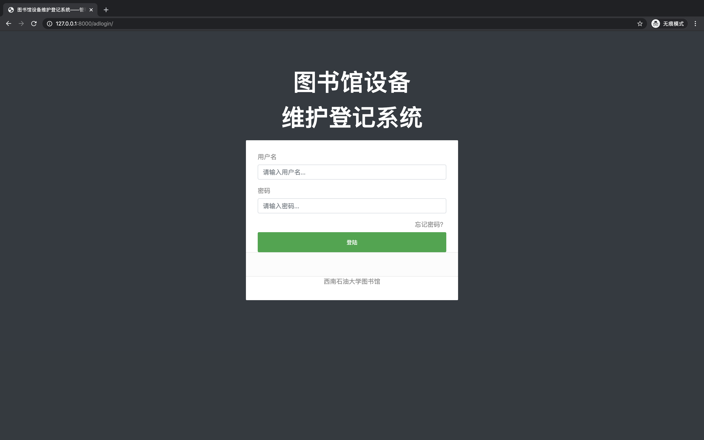

按钮一键导出

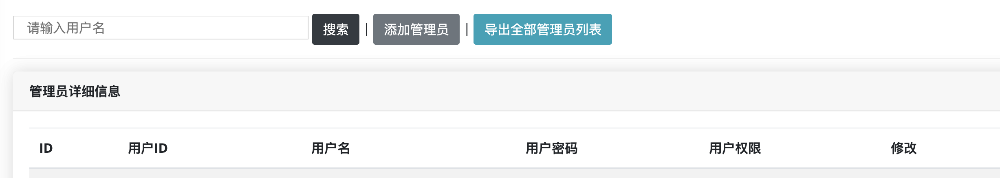

选择文件进行上传

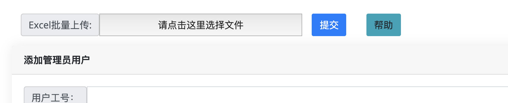

用户可以查看帮助以及下载模版进行导入，增强准确性，当然后台也写了判断语句，并添加了事务控制回滚，不会乱添加

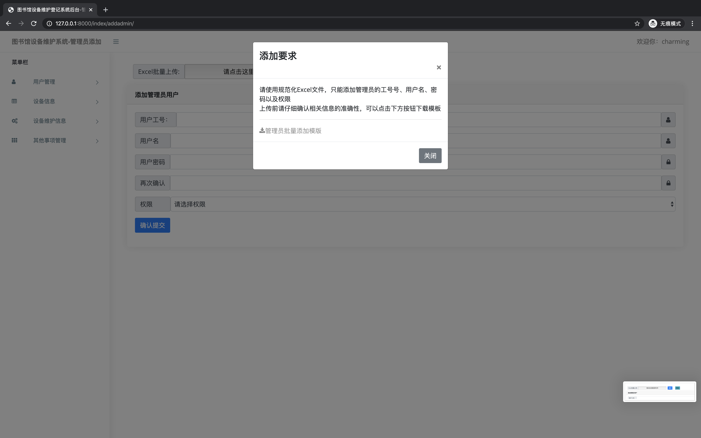